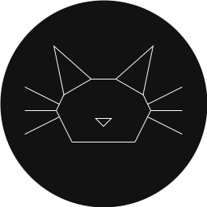
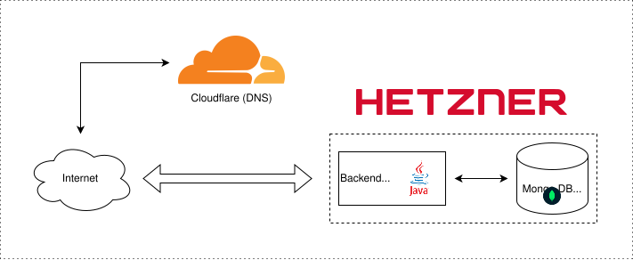

# Gatto's Lab

Simple, *mostly static*, website about my personal projects that uses the following technologies:

- Java 26 with Spring Boot and MongoDB for the backend.
- Vanilla HTML, CSS and JavaScript for the frontend.
- Jenkins for building and deploying the application into a Hetzner VPS.

 

